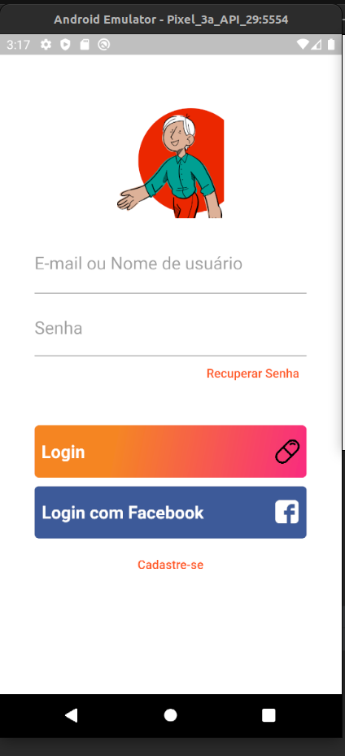
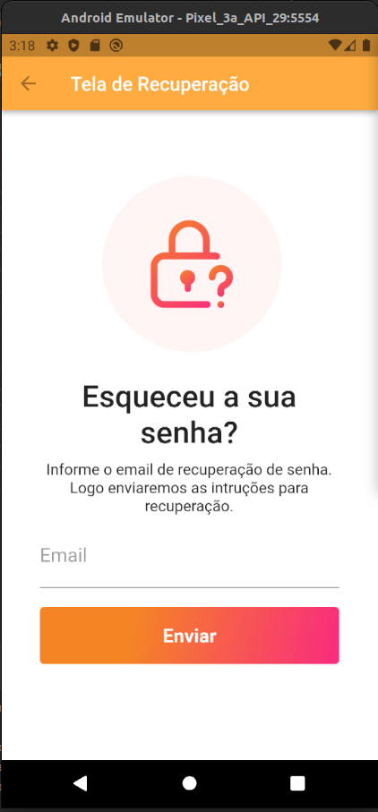
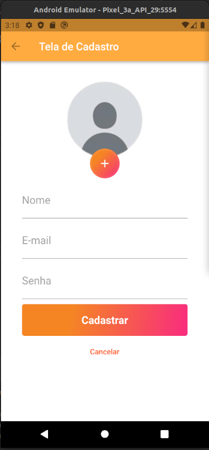

# login_screen

A new Flutter project => "Tá na hora!"

## Getting Started

This project was made with the intention of practicing my flutter studies. In addition, it is a recreation of the "Tá na hora" app interface, which was idealized and presented in a pitch for the curricular component digital entrepreneurship and special topics.

The application is focused  statuon optimizing the medication process, especially in elderly people.

## Screenshots

Home Screen

Reset-pasword Screen

Signup Screen